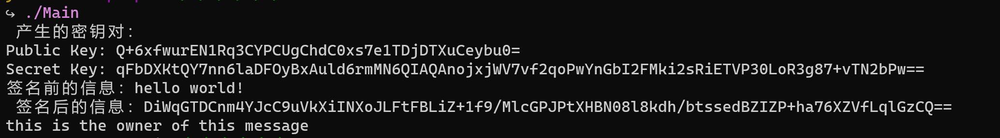

# ed25519
## 测试代码描述

``` cpp
//使用openssl的base64编码显示输出
//to base64 
std::string to_base64(const unsigned char* data, size_t length) {
    // Create a memory BIO that will hold the Base64 data
    BIO *b64 = BIO_new(BIO_f_base64());
    BIO *mem = BIO_new(BIO_s_mem());
    BIO_set_flags(b64, BIO_FLAGS_BASE64_NO_NL); // Do not use newlines
    BIO_push(b64, mem);

    // Write data to the BIO
    BIO_write(b64, data, length);
    BIO_flush(b64);

    // Now get the data from the memory BIO
    char* base64_data;
    long base64_length = BIO_get_mem_data(mem, &base64_data);
    std::string base64_string(base64_data, base64_length);

    // Clean up
    BIO_free_all(b64);

    return base64_string;
}

//主函数
int 
main()
{
    //init
    unsigned char publicKey[32];
    unsigned char secretKey[64];
    unsigned char signature[64];
    unsigned char seed[32];

    //creat new keypair
    ed25519_create_keypair(publicKey, secretKey,seed);
    string PublicKey = to_base64(publicKey,32);
    string SecretKey = to_base64(secretKey,64);
    cout << " 产生的密钥对：" << std::endl;
    cout << "Public Key: " << PublicKey << std::endl;
    cout << "Secret Key: " << SecretKey << std::endl;

    //Sign a message
    //unsigned char* message = "hello world!"
    const unsigned char* message = (const unsigned char*)"hello world!";
    cout <<"签名前的信息："  << message << endl;
    ed25519_sign(signature, message, 13,publicKey, secretKey);
    string Signature = to_base64(signature,64); 
    cout << " 签名后的信息：" << Signature << std::endl;

    // Verify the signature
    if(ed25519_verify(signature, message,13,publicKey)) 
        cout << "this is the owner of this message" << endl;
    else 
        
    return 0;
}

```


## 程序运行

``` shell
cd ed25519
make 
./Main
```



## 关键代码描述

``` cpp
//file sha3.c
/*sha3_init
功能：初始化SHA-3哈希上下文。
描述：这个函数用于初始化SHA-3哈希计算所需的上下文信息。它接收一个指向SHA-3哈希上下文的指针c以及哈希输出的字节长度mdlen。函数首先将SHA-3哈希上下文中的状态数组st.q的所有元素都设置为0，然后计算并设置内部状态数组的大小rsiz，最后将当前处理位置pt初始化为0。函数返回1表示成功。*/
int
sha3_init(sha3_ctx_t* c, int mdlen) {
  int i;

  for (i = 0; i < 25; i++) c->st.q[i] = 0;
  c->mdlen = mdlen;
  c->rsiz  = 200 - 2 * mdlen;
  c->pt    = 0;

  return 1;
}

/*sha3_update
功能：更新SHA-3哈希上下文，将输入数据添加到哈希计算中。
描述：这个函数用于将输入数据添加到SHA-3哈希计算中。它接收一个指向SHA-3哈希上下文的指针c，输入数据的指针data以及数据的长度len。函数会将输入数据按字节逐个异或（XOR）到内部状态数据中，并在必要时触发Keccak-f[1600]置换。函数返回1表示成功。*/
int
sha3_update(sha3_ctx_t* c, const void* data, size_t len) {
  size_t i;
  int j;

  j = c->pt;
  for (i = 0; i < len; i++) {
    c->st.b[j++] ^= ((const uint8_t*)data)[i];
    if (j >= c->rsiz) {
      sha3_keccakf(c->st.q);
      j = 0;
    }
  }
  c->pt = j;

  return 1;
}

/*sha3_final

功能：完成SHA-3哈希计算并输出哈希值。
描述：这个函数用于完成SHA-3哈希计算，包括添加填充数据、执行Keccak-f[1600]置换并生成最终的哈希值。函数接收一个指向哈希输出的缓冲区的指针md以及指向SHA-3哈希上下文的指针c。它将填充数据添加到内部状态，并在状态中的最后一个字节上设置特定位，然后触发Keccak-f[1600]置换。最后，它将生成的哈希值复制到输出缓冲区中。*/
int
sha3_final(void* md, sha3_ctx_t* c) {
  int i;

  c->st.b[c->pt] ^= 0x06;
  c->st.b[c->rsiz - 1] ^= 0x80;
  sha3_keccakf(c->st.q);

  for (i = 0; i < c->mdlen; i++) {
    ((uint8_t*)md)[i] = c->st.b[i];
  }

  return 1;
}

/*sha3

功能：计算给定输入数据的SHA-3哈希值。
描述：这个函数是SHA-3哈希计算的高级接口，用于计算任意长度的输入数据的SHA-3哈希值。它会自动初始化SHA-3哈希上下文、更新数据并生成哈希值。函数接收输入数据的指针in，输入数据的长度inlen，输出哈希值的缓冲区的指针md以及哈希输出的字节长度mdlen。函数内部创建了一个SHA-3哈希上下文，并通过调用sha3_init、sha3_update和sha3_final来完成整个哈希计算过程。最后，它返回指向计算得到的哈希值的指针。*/
void*
sha3(const void* in, size_t inlen, void* md, int mdlen) {
  sha3_ctx_t sha3;

  sha3_init(&sha3, mdlen);
  sha3_update(&sha3, in, inlen);
  sha3_final(md, &sha3);

  return md;
}
```


``` cpp
/*ed25519_create_keypair

功能：生成Ed25519公钥对。

描述：这个函数用于生成Ed25519签名算法的公钥对，包括公钥和私钥。函数接收以下参数：

public_key：用于存储生成的公钥的缓冲区。
private_key：用于存储生成的私钥的缓冲区。
seed：作为生成私钥的种子数据。
函数的具体步骤如下：

使用SHA-3哈希函数计算seed的哈希值，将结果存储在private_key中。这个哈希值通常作为Ed25519的私钥。
将private_key的第一个字节的前3位设置为0，以确保私钥的一些位被固定为0。
将private_key的最后一个字节的前2位设置为0，然后将最后一个字节的第7位设置为1，以确保私钥的一些位被固定为特定值。
使用ge_scalarmult_base函数计算公钥，这个函数将私钥作为输入，并将结果存储在A变量中。
最后，将A中的公钥数据复制到public_key中，得到最终的公钥。*/
void
ed25519_create_keypair(
    unsigned char* public_key, unsigned char* private_key,
    const unsigned char* seed) {
  ge_p3 A;

  sha3(seed, 32, private_key, 64);
  private_key[0] &= 248;
  private_key[31] &= 63;
  private_key[31] |= 64;

  ge_scalarmult_base(&A, private_key);
  ge_p3_tobytes(public_key, &A);
}

/*ed25519_verify

功能：验证Ed25519签名。

描述：这个函数用于验证Ed25519签名，以确定签名是否有效。函数接收以下参数：

signature：要验证的签名。
message：签名消息的数据。
message_len：签名消息的长度。
public_key：与签名相关联的公钥。
函数的具体步骤如下：

首先，检查signature的最后一个字节的前3位是否都为0，如果不是则返回0，因为这些位应该是0。
使用ge_frombytes_negate_vartime函数将public_key解析为ge_p3类型的公钥A。如果解析失败（返回非0），则返回0。
使用SHA-3哈希函数初始化hash上下文，并对signature、public_key和message进行哈希计算，将结果存储在h中。
使用sc_reduce函数对哈希结果h进行归约，以确保它在特定范围内。
使用ge_double_scalarmult_vartime函数计算R，这是一个点的倍数运算，涉及私钥、公钥和一部分signature数据。
使用ge_tobytes函数将R中的点数据复制到checker中。
最后，通过比较checker和signature来验证签名的有效性，如果相等则返回1，否则返回0。*/

int
ed25519_verify(
    const unsigned char* signature, const unsigned char* message,
    size_t message_len, const unsigned char* public_key) {
  unsigned char h[64];
  unsigned char checker[32];
  sha3_ctx_t hash;
  ge_p3 A;
  ge_p2 R;

  if (signature[63] & 224) {
    return 0;
  }

  if (ge_frombytes_negate_vartime(&A, public_key) != 0) {
    return 0;
  }

  sha3_init(&hash, 64);
  sha3_update(&hash, signature, 32);
  sha3_update(&hash, public_key, 32);
  sha3_update(&hash, message, message_len);
  sha3_final(h, &hash);

  sc_reduce(h);
  ge_double_scalarmult_vartime(&R, h, &A, signature + 32);
  ge_tobytes(checker, &R);

  if (!consttime_equal(checker, signature)) {
    return 0;
  }

  return 1;
}


/*ed25519_sign

功能：对消息进行签名并生成Ed25519签名。

描述：这个函数用于对给定的消息进行签名，生成Ed25519签名。函数接收以下参数：

signature：用于存储生成的签名的缓冲区。
message：待签名的消息的数据。
message_len：待签名消息的长度。
public_key：与签名相关联的公钥。
private_key：与签名相关联的私钥。
函数的具体步骤如下：

使用SHA-3哈希函数初始化hash上下文，并对私钥的一部分和消息进行哈希计算，将结果存储在r中。
使用sc_reduce函数对哈希结果r进行归约，以确保它在特定范围内。
使用ge_scalarmult_base函数计算基点乘以r的结果，并将结果存储在R中。
使用ge_p3_tobytes函数将R中的点数据复制到signature的前32字节中。
使用SHA-3哈希函数初始化另一个hash上下文，并对signature、public_key和消息进行哈希计算，将结果存储在hram中。
使用sc_reduce函数对哈希结果hram进行归约，以确保它在特定范围内。
使用sc_muladd函数将hram乘以私钥并加上r，将结果存储在signature的后32字节中。*/
void
ed25519_sign(
    unsigned char* signature, const unsigned char* message, size_t message_len,
    const unsigned char* public_key, const unsigned char* private_key) 
{
  sha3_ctx_t hash;
  unsigned char hram[64];
  unsigned char r[64];
  ge_p3 R;

  sha3_init(&hash, 64);
  sha3_update(&hash, private_key + 32, 32);
  sha3_update(&hash, message, message_len);
  sha3_final(r, &hash);

  sc_reduce(r);
  ge_scalarmult_base(&R, r);
  ge_p3_tobytes(signature, &R);

  sha3_init(&hash, 64);
  sha3_update(&hash, signature, 32);
  sha3_update(&hash, public_key, 32);
  sha3_update(&hash, message, message_len);
  sha3_final(hram, &hash);

  sc_reduce(hram);
  sc_muladd(signature + 32, hram, private_key, r);
}


```

